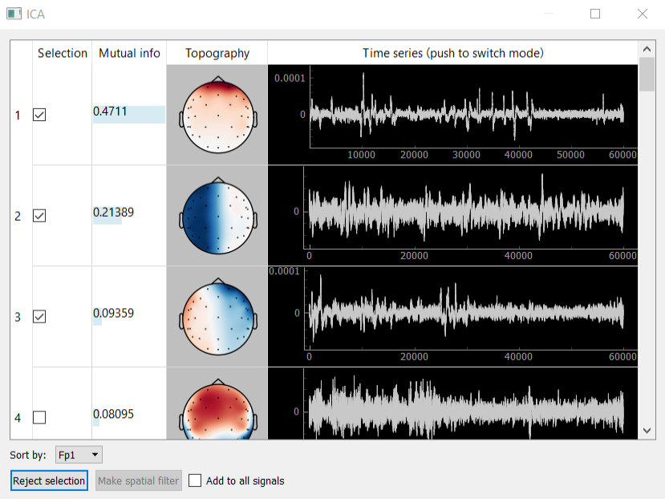
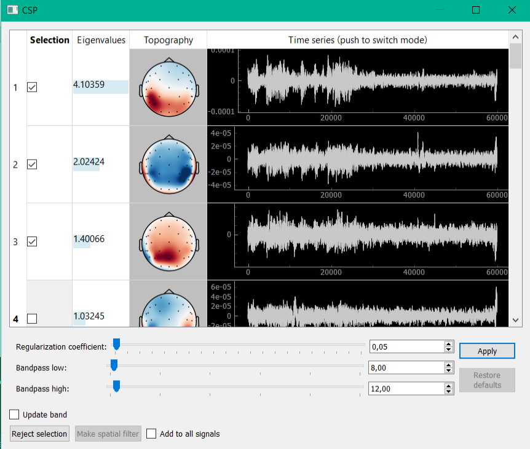
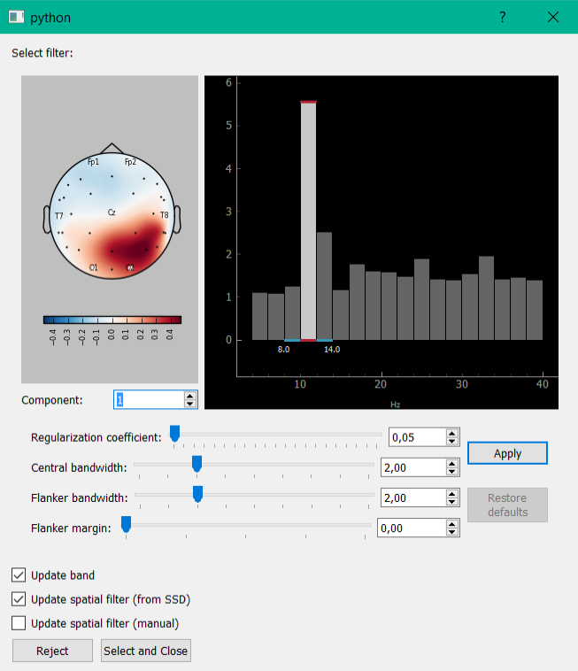
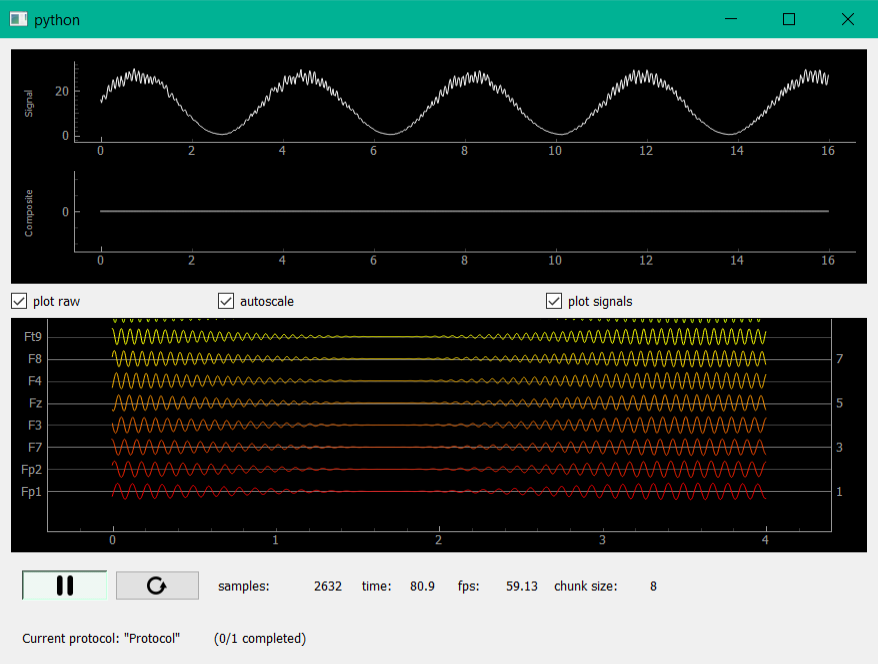
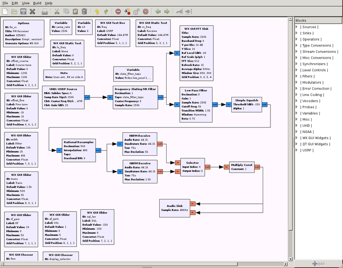

# Software

.Experiment Designer
image:images/nfb_lab/design.png[]

Inlet: selection of the data stream to which you want to connect. There is a choice of four options: Normal LSL stream (for connection of devices with LSL support), LSL generator (created LSL flow with a model signal for the test program), LSL from file (created LSL signal playback stream recorded in the file during the previous experiments), FieldTripBuffer (connection for FieldTripBuffer Protocol).

image:images/nfb_lab/protocol.png[]

'''

https://github.com/labstreaminglayer/App-SerialPort[Emit LSL Stream via SerialPort & chosen baud rate]

LabRecorder is the default recording program that comes with https://github.com/labstreaminglayer/App-LabRecorder[LSL]. The file format used by the LabRecorder is https://github.com/sccn/xdf[XDF]. This is an open general-purpose format that was designed concurrently with LSL and supports all features of LSL streams.

'''

https://github.com/xdf-modules/pyxdf[pyxdf] can be used as shown to send data to another program.

'''

.Independent Component Analysis

Method ICA (independent component analysis) is used to decompose the signal into independent components and is used for the isolation and removal of various kinds of artifacts. Designed graphical interface to visualize and select the component allows you to display the components themselves (column Time series), their spectra (column Time series after clicking on the column header) and topography (Topography column), sort them by mutual information with a certain channel. Calculations of the expansion are carried out using the ICA class of mne package. Buttons allow the bottom panel to add to the signal bandstop filter for the artifact removal filter or to isolate any of the components.

'''

.Common Spatial Pattern

Interface for CSP (common spatial pattern) decomposition allows you to select components with the highest ratio of signal power to the two windows (usually the first window corresponds to the first half of the recording, in which subject stays with closed eyes, in the second - open). A key part of the algorithm is the solution of the generalized eigenvalue problem. Algorithm parameters handed down and can be adjusted by sliders at the bottom of the window. https://nfb-lab.readthedocs.io/en/latest/csp.html[Example: allotment and removal of the alpha activity.]

'''

.Spatio-Spectral Decomposition

In the SSD method (spatio-spectral decomposition) decomposition also occurs by solving the generalized eigenvalue problem. This method allows you to select components with maximum signal power ratio for two different frequency bands (the central strip and the adjacent frequency). Implemented the possibility to partitioning the signal into strips, control their width. At the bottom, you allow to add to the bandstop filter signal from the selected filter components, or to isolate any of the components.

'''

.Composite Signal Settings

This window displays the processed, composite and raw signals, as well as some adjustments of its displaying (plot raw - enables / disables rendering of the raw signals; autoscale - enables / disables the automatic scaling of raw signal; plot signals - enables / disables rendering of processed and composite signals).

'''

.LSL Audio
https://github.com/labstreaminglayer/App-AudioCapture[The AudioCapture application uses Qt's QAudioInput for cross-platform audio capturing.]

'''

.ecog2txt
https://github.com/jgmakin/ecog2txt[Code for decoding speech as text from neural data]

'''

.GNUradio

https://github.com/gnuradio/gnuradio/[GNUradio]
